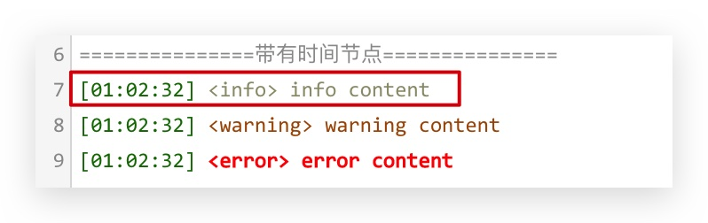

### 日志模式

根据业务衍生的日志模式，分为普通日志模式和自定义日志模式，如下：

#### 简单日志模式（mode: "log"）

- 默认情况下，首字母大写的单词会显示为红色

<component v-if="log" :is="log"></component>

```vue log-mode-demo
<template>
  <demo-preview v-bind="{ ...$attrs, ...$props }" name="log-mode-demo">
    <Codemirror
      v-model:value="code"
      :options="cmOptions"
      border
      :height="400"
    />
  </demo-preview>
</template>

<script>
import { ref, defineComponent } from "vue";
import Codemirror, {
  createLinkMark,
  createLogMark,
  createTitle,
} from "codemirror-editor-vue3";

export default defineComponent({
  components: { Codemirror },
  setup() {
    const code = ref(`完整日志下载地址：${createLinkMark({
      href: "/logDownload",
      download: "",
      target: "_blank",
    })}
${createTitle("基本日志")}
${createLogMark("2021-08-26 15:07:09: job is success", "info")}
${createLogMark("2021-08-26 15:07:09: job is success", "warning")}
${createLogMark("2021-08-26 15:07:09: job is error", "error")}
${createTitle("带有时间节点")}
${createLinkMark({ href: "/logDownload", download: "", target: "_blank" })}

====================引擎日志====================

DataStreamMain start
java.lang.NullPointerException
at
at java.util.Properties.load0(Properties.java:353)
at java.util.Properties.load(Properties.java:341)
at com.zhiweicloud.dataprocess.util.common.PropertiesUtil.getStringByKey(PropertiesUtil.
at com.zhiweicloud.dataprocess.engine.FlinkEngine.readFlinkEngineConfig(FlinkEngine.
at com.zhiweicloud.dataprocess.engine.FlinkEngine.buildFlinkStream(FlinkEngine.
at com.zhiweicloud.dataprocess.engine.FlinkEngine.startFlinkEngine(FlinkEngine.
at com.zhiweicloud.dataprocess.DataStreamMain.main(DataStreamMain.
 `);
    const cmOptions = {
      mode: "log",
      theme: "default",
    };
    return {
      Codemirror,
      createLinkMark,
      createLogMark,
      createTitle,
      ref,
      code,
      cmOptions,
    };
  },
});
</script>
```

#### 自定义日志模式（mode: "fclog"）

<component v-if="fcLog" :is="fcLog"></component>

```vue fclog-mode-demo
<template>
  <demo-preview v-bind="{ ...$attrs, ...$props }" name="fclog-mode-demo">
    <Codemirror
      v-model:value="code"
      :options="cmOptions"
      border
      :height="400"
    />
    <a href=""></a>
  </demo-preview>
</template>

<script>
import { ref, defineComponent } from "vue";
import Codemirror, {
  createLinkMark,
  createLogMark,
  createLog,
  createTitle,
} from "codemirror-editor-vue3";

export default defineComponent({
  components: { Codemirror },
  setup() {
    const code = ref(`完整日志下载地址：${createLinkMark({
      href: "/logDownload",
      download: "",
      target: "_blank",
    })}
${createTitle("基本日志")}
${createLogMark("2021-08-26 15:07:09: job is success", "info")}
${createLogMark("2021-08-26 15:07:09: job is success", "warning")}
${createLogMark("2021-08-26 15:07:09: job is error", "error")}
${createTitle("带有时间节点")}
${createLog("info content", "info")}
${createLog("warning content", "warning")}
${createLog("error content", "error")}
${createLinkMark({ href: "/logDownload", download: "", target: "_blank" })}

${createTitle("引擎日志")}

DataStreamMain start
java.lang.NullPointerException
at
at java.util.Properties.load0(Properties.java:353)
at java.util.Properties.load(Properties.java:341)
at com.zhiweicloud.dataprocess.util.common.PropertiesUtil.getStringByKey(PropertiesUtil.
at com.zhiweicloud.dataprocess.engine.FlinkEngine.readFlinkEngineConfig(FlinkEngine.
at com.zhiweicloud.dataprocess.engine.FlinkEngine.buildFlinkStream(FlinkEngine.
at com.zhiweicloud.dataprocess.engine.FlinkEngine.startFlinkEngine(FlinkEngine.
at com.zhiweicloud.dataprocess.DataStreamMain.main(DataStreamMain.
 `);
    const cmOptions = {
      mode: "fclog",
      theme: "default",
    };
    return {
      Codemirror,
      createLinkMark,
      createLogMark,
      createLog,
      createTitle,
      ref,
      code,
      cmOptions,
    };
  },
});
</script>
```

<script>
import { shallowRef } from "vue"

export default {
  data() {
    return {
      log: null,
      fcLog:null
    }
  },

  mounted() {
    import('../views/demo/log/index.vue').then((module) => {
      this.log = shallowRef(module.default)
    })
    import('../views/demo/log/fclog.vue').then((module) => {
      this.fcLog = shallowRef(module.default)
    })
  }
}
</script>

---

### 日志模式方法说明（public）

::: tip
以下方法为 `log` 模式和 `fclog` 模式共享方法
:::
| 名称 | 说明 | 参数 | 案例 |
| ------ |:------------------:| :--------|:------:|
| `createLinkMark` | 创建一个可点击的连接（a 标签），如下载完整日志 | 支持所有 a 标签属性，如：`{ href: "/target-link", download: "", target: "_blank" }` |  |
| `createLogMark` | 标记日志的输出类型 | (text: string, **`'info'`**) => void|  |
| | | (text: string, type: **`'warning'`**) => void|  |
| | | (text: string, type: **`'error'`**) => void|  |
| `getLogMark` | 获取当前标记的文本，返回节点数组 | `(value: string) => [{start: number, end: number ,node: HTMLElement}]`| - |
| `createTitle` | 创建标题 | `(value: string, symbolLength?: number = 15, symbol?:string = "=") => string`|  |

### 自定义日志模式方法说明（mode: "fclog"）

::: tip
以下方法仅为 `fclog` 模式方法
:::

| 名称        |              说明              | 参数                                            |             案例             |
| ----------- | :----------------------------: | :---------------------------------------------- | :--------------------------: |
| `createLog` | 创建带有时间以及类型的日志文本 | (log: string, type: **`'info'`**) => string     |     |
|             |                                | (text: string, type: **`'warning'`**) => string |  |
|             |                                | (text: string, type: **`'error'`**) => string   |    |
