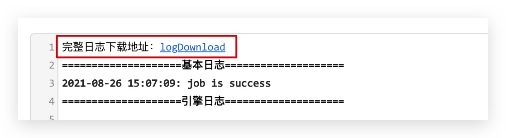
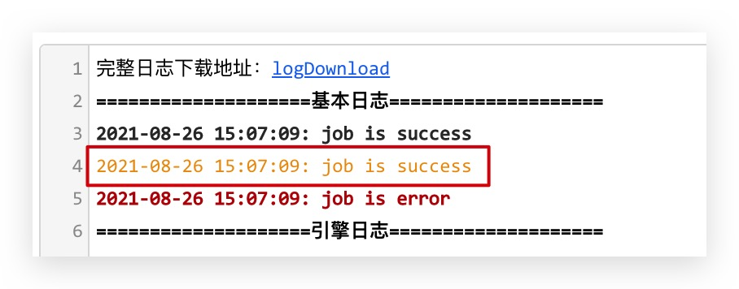
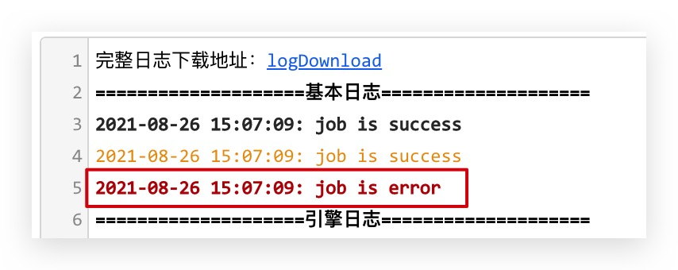
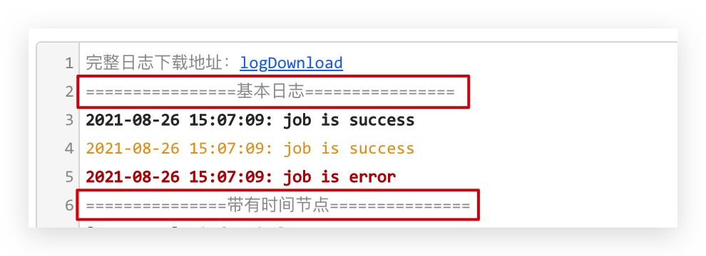
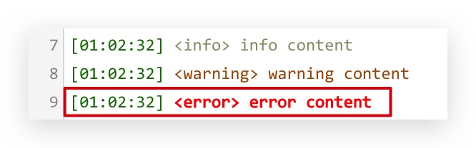

# 日志模式

根据业务衍生的日志模式，分为普通日志模式和自定义日志模式，如下：

## 简单日志模式（`mode: "log"`）

> 默认情况下，首字母大写的单词会显示为红色

<component v-if="log" :is="log"></component>

:::details 点击查看代码

```vue
<template>
  <Codemirror v-model:value="code" :options="cmOptions" border :height="400" />
</template>

<script>
  import { ref, defineComponent } from "vue"
  import Codemirror, { createLinkMark, createLogMark, createTitle } from "codemirror-editor-vue3"

  export default defineComponent({
    components: { Codemirror },
    setup() {
      const code = ref(`完整日志下载地址：${createLinkMark({
        href: "/logDownload",
        download: "",
        target: "_blank"
      })}
${createTitle("可以标记每一行日志的输出类型")}
${createLogMark("2021-08-26 15:07:09: job is success", "info")}
${createLogMark("2021-08-26 15:07:09: job is success", "warning")}
${createLogMark("2021-08-26 15:07:09: job is error", "error")}

====================引擎日志====================

DataStreamMain start
java.lang.NullPointerException
at
at java.util.Properties.load0(Properties.java:353)
at java.util.Properties.load(Properties.java:341)
at com.zhiweicloud.dataprocess.util.common.PropertiesUtil.getStringByKey(PropertiesUtil.
at com.zhiweicloud.dataprocess.engine.FlinkEngine.readFlinkEngineConfig(FlinkEngine.
at com.zhiweicloud.dataprocess.engine.FlinkEngine.buildFlinkStream(FlinkEngine.
at com.zhiweicloud.dataprocess.engine.FlinkEngine.startFlinkEngine(FlinkEngine.
at com.zhiweicloud.dataprocess.DataStreamMain.main(DataStreamMain.
 `)
      const cmOptions = {
        mode: "log",
        theme: "default"
      }
      return {
        code,
        cmOptions
      }
    }
  })
</script>
```

:::

## 自定义日志模式（`mode: "fclog"`）

<component v-if="fcLog" :is="fcLog"></component>

:::details 点击查看代码

```vue
<template>
  <Codemirror v-model:value="code" :options="cmOptions" border :height="400" />
  <a href=""></a>
</template>

<script>
  import { ref, defineComponent } from "vue"
  import Codemirror, {
    createLinkMark,
    createLogMark,
    createLog,
    createTitle
  } from "codemirror-editor-vue3"

  export default defineComponent({
    components: { Codemirror },
    setup() {
      const code = ref(`完整日志下载地址：${createLinkMark({
        href: "/logDownload",
        download: "",
        target: "_blank"
      })}

${createTitle("带有时间节点和输出类型的日志")}
${createLog("info content", "info")}
${createLog("warning content", "warning")}
${createLog("error content", "error")}
`)
      const cmOptions = {
        mode: "fclog",
        theme: "default"
      }
      return {
        code,
        cmOptions
      }
    }
  })
</script>
```

:::

## 日志模式方法说明

| 名称 | 说明 | 参数 | 案例 |
| --- | :-: | :-- | :-: |
| `createLinkMark` | 创建一个可点击的连接（a 标签），如下载完整日志 | 支持所有 a 标签属性，如：`{ href: "/target-link", download: "", target: "_blank" }` |  |
| `createLogMark` | 标记日志的输出类型 | (text: string, type: `'info' \| 'warning' \| 'error'`) => void |  |
| `getLogMark` | 获取当前标记的文本，返回节点数组 | `(value: string) => [{start: number, end: number ,node: HTMLElement}]` | - |
| `createTitle` | 创建标题 | `(value: string, symbolLength?: number = 15, symbol?:string = "=") => string` |  |
| `createLog` | **仅在 fclog 模式下使用**，创建带有时间以及类型的日志文本 | (text: string, type: `'info' \| 'warning' \| 'error'`) => void |  |

<script>
import { shallowRef } from "vue"

export default {
  data() {
    return {
      log: null,
      fcLog:null
    }
  },

  mounted() {
    import('../../../demo/log/index.vue').then((module) => {
      this.log = shallowRef(module.default)
    })
    import('../../../demo/log/fclog.vue').then((module) => {
      this.fcLog = shallowRef(module.default)
    })
  }
}
</script>
